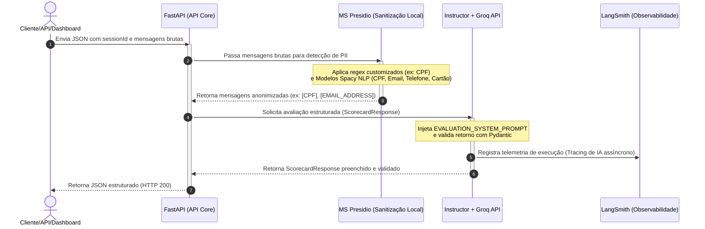

# LLM-as-a-Judge - Avaliação de Conversas de Atendimento

Este projeto implementa um sistema de "LLM-as-a-Judge" para avaliar a qualidade de conversas de atendimento ao cliente. A aplicação realiza a sanitização de dados sensíveis (PII) antes de enviar a conversa para avaliação por meio da API do Groq (utilizando Pydantic e Instructor para estruturação das saídas) e inclui suporte à observabilidade com LangSmith.

---

## 📐 Documento de Solução & Arquitetura (LLM-as-a-Judge)

Este documento detalha as especificações do sistema de inteligência artificial aplicada, cobrindo a visão geral da solução, o desenho do fluxo, decisões técnicas, estratégias empregadas, comparação de alternativas e visão evolutiva da aplicação.

---

### 1. Visão Geral da Solução

O objetivo principal desta solução é automatizar e escalar o processo de auditoria de qualidade de atendimentos realizados em canais de chat e WhatsApp (com possibilidade futura de expansão para áudio de voz). Tradicionalmente, esse processo de monitoria de qualidade é manual, lento, amostral e propenso a inconsistências humanas. 

Para solucionar esse problema, propomos e implementamos um sistema de **LLM-as-a-Judge** assíncrono, stateless e integrado com mecanismos de privacidade de dados. A aplicação recebe conversas brutas de atendimento, sanitiza informações pessoais identificáveis (PII) localmente para garantir estrita conformidade com a LGPD e aciona um LLM de alta velocidade para avaliar o desempenho do operador de acordo com rubricas de negócio rígidas. O retorno é estruturado garantindo que as chaves, tipos de dados e notas de critérios como *Empatia*, *Aderência ao Protocolo*, *Controle de Alucinação* e *Identificação de Necessidades* sejam 100% consistentes e prontos para alimentar pipelines analíticos de negócios.

---

### 2. Desenho do Fluxo de Execução

O fluxo de dados da requisição até a geração do Scorecard validado é apresentado no diagrama abaixo:


---

### 3. Decisões Técnicas & Justificativas

A stack do projeto foi selecionada cirurgicamente com foco em robustez, latência, segurança regulatória e facilidade de manutenção:

*   **FastAPI (Python Assíncrono):** Escolhido devido ao suporte nativo a operações de E/S assíncronas com `async/await` (altamente eficiente para chamadas externas à API de LLM), excelente performance de processamento e documentação interativa automática com Swagger UI.
*   **Microsoft Presidio (Sanitização de PII Local):** Uma das maiores preocupações corporativas no uso de LLMs na nuvem é a segurança de dados. O Presidio permite identificar e anonimizar dados confidenciais (CPF, e-mail, telefone, cartões) localmente no servidor antes de trafegar os dados pela internet, mitigando riscos de vazamento de dados de clientes e garantindo total conformidade com a LGPD e GDPR.
*   **Groq API (LPU - Language Processing Unit):** A velocidade de inferência é um gargalo comum em projetos de LLM. O Groq oferece tempos de resposta extremamente baixos (inferiores a 3 segundos por avaliação) para modelos avançados, permitindo uma experiência de dashboard ágil para o auditor de atendimento.
*   **Instructor (Structured Outputs via Pydantic):** A maior dor ao construir integrações de IA é a incerteza do formato de saída. O Instructor resolve esse problema envelopando o cliente Groq e forçando o uso de *Function Calling* para preencher um modelo Pydantic rígido. Se o modelo falhar nas validações (ex: nota fora do intervalo 1-5), o Instructor realiza retentativas (auto-retry) automáticas, provendo 100% de estabilidade ao contrato da API.
*   **LangSmith (Observabilidade e Tracing):** Fornece telemetria completa de ponta a ponta sobre as execuções da inteligência artificial. Permite inspecionar a latência por etapa, o consumo exato de tokens, visualizar o prompt enviado e a resposta recebida, tornando o sistema transparente e auditável.

---

### 4. Estratégia de Prompts

A engenharia de prompts foi estruturada sob o padrão de **Avaliador Crítico Baseado em Rubricas**:
*   **Rubricas Rígidas de Nota:** Para reduzir a subjetividade da avaliação automática, o prompt de sistema (`EVALUATION_SYSTEM_PROMPT`) define o que caracteriza notas de 1 (péssimo) a 5 (excelente) para cada um dos quatro critérios de avaliação de forma explícita.
*   **Controle Contrato-Linguagem:** O prompt força a API do LLM a manter o formato JSON e as chaves técnicas em inglês (`score`, `justification`, `evidence`) para perfeita coesão com o Pydantic, enquanto os textos das justificativas e das evidências são gerados em português brasileiro (pt-BR) para consumo direto pelas áreas de negócio.
*   **Extração de Evidências Rígida:** O juiz é obrigado a extrair citações literais da conversa original para justificar o score. Isso mitiga severamente o risco de "alucinações da avaliação", garantindo transparência e auditabilidade em caso de discordância do atendente ou supervisor humano.

---

### 5. Estratégia de Modelos

*   **Abstração e Parametrização:** O modelo utilizado é configurado por meio da variável de ambiente `GROQ_MODEL`. Isso garante interoperabilidade total, permitindo testar e migrar para novos modelos sem a necessidade de reescrever ou republicar o código da aplicação.
*   **Adoção de Modelos Sólidos de Raciocínio (ex: Llama 3.1 70B):** Para tarefas de avaliação qualitativa e análise de nuances de empatia e conformidade de protocolos de negócios, modelos de maior escala (70 bilhões de parâmetros ou mais) se provam significativamente mais consistentes na tomada de decisões lógicas complexas e na adesão estrita ao sistema de rubricas, reduzindo falsos positivos na monitoria.

---

### 6. Estratégia de Orquestração

*   **Python Assíncrono Declarativo ("No-Framework"):** Optou-se por não utilizar frameworks pesados de orquestração (como LangChain ou CrewAI) para evitar complexidade acidental, overhead de latência e consumo desnecessário de memória. O fluxo é limpo e orquestrado diretamente com Python assíncrono (`async/await`) utilizando a integração declarativa do Instructor, garantindo controle absoluto do pipeline de dados.

---

### 7. Comparação de Alternativas Arquiteturais

Abaixo, apresentamos os trade-offs entre o design atual e uma alternativa projetada para escala enterprise:

| Dimensão | Abordagem A (Simples - Adotada no MVP) | Abordagem B (Sofisticada - Visão de Produção/Escala) |
| :--- | :--- | :--- |
| **Descrição Geral** | Arquitetura monolítica stateless baseada em FastAPI com processamento de PII local e chamada assíncrona ao Groq. | Arquitetura distribuída e orientada a eventos. API recebe o payload, publica em fila e responde imediatamente. Workers processam em background de forma assíncrona. |
| **Armazenamento e Estado** | Sem estado (Stateless), delega persistência para quem consome a API. | PostgreSQL (histórico de avaliações) + Redis (Cache semântico de conversas) + Vector DB (auditoria semântica). |
| **Processamento** | Concorrente em memória através de FastAPI Event Loop e Async Python. | Distribuído por Workers assíncronos (Celery / RQ) rodando em contêineres separados. |
| **Resiliência** | Falhas de rate limit do Groq ou erros de rede exigem reenvio da requisição pelo cliente. | Filas persistentes garantem retentativas automáticas e backoff exponencial sem perda de requisições. |
| **Custo e Infraestrutura** | Muito baixo. Deployment em contêiner único. | Moderado a Alto. Custo operacional de gerenciamento de bancos de dados, filas (RabbitMQ/Kafka) e múltiplos workers. |
| **Latência** | Baixa (~2-5 segundos por chamada síncrona). | Latência assíncrona (segundos ou minutos) com notificação via webhook ou consulta a banco de dados. |

#### Justificativa da Escolha da Abordagem A para o MVP:
A **Abordagem A** foi selecionada por priorizar o tempo de lançamento no mercado (*Time-to-Market*) e a facilidade de validação dos critérios de avaliação de IA pelo cliente. Ela permite validar as hipóteses de negócio rapidamente (qualidade do julgamento, latência percebida e precisão de PII) sem adicionar complexidade acidental de infraestrutura que poderia inviabilizar um desenvolvimento ágil. Por ter uma lógica de negócio desacoplada (camada `app/services/`), o código está pronto para evoluir para a **Abordagem B** de forma modular quando o volume de chamadas exigir processamento assíncrono em lote.

---

### 8. Riscos, Limitações e Próximos Passos (Visão Evolutiva)

#### Riscos:
1.  **Mudanças de Modelos na Nuvem (API Drift):** Mudanças internas nos modelos da Groq podem alterar o padrão de atribuição de notas.
2.  **Falsos Negativos de PII:** Padrões linguísticos informais muito específicos do português (ex: grafias erradas de e-mail ou telefone) podem passar pela detecção de PII.

#### Limitações:
1.  **Formato de Texto Único:** O MVP suporta apenas conversas de texto puro.
2.  **Rate limits da API Externa:** Dependência de limites de requisições por minuto do provedor da API do LLM.

#### Próximos Passos (Evolução Técnica):
1.  **Transcritor de Voz (Módulo de Voz):** Acoplar um serviço com Whisper (Groq Whisper API) antes da anonimização para receber arquivos de áudio (.wav, .mp3) e permitir avaliação de atendimentos por telefone.
2.  **Modelos Locais de PII para pt-BR:** Realizar o fine-tuning de um modelo do spaCy ou utilizar BERT/RoBERTa local especializado em português para otimizar o Microsoft Presidio em entidades regionais.
3.  **Cache Semântico com Redis:** Implementar um cache semântico baseado em busca vetorial para identificar conversas extremamente similares (ou idênticas) já avaliadas anteriormente, retornando a resposta instantaneamente sem custo de tokens.
4.  **Recalibração e Alinhamento Humano (RLAIF/DPO):** Coletar feedbacks de curadores de qualidade humanos a partir do LangSmith e aplicar técnicas de alinhamento sistemático para calibrar o prompt do juiz às reais necessidades da empresa.

---

## 🚀 Requisitos e Dependências

As principais tecnologias e dependências utilizadas são:
* **Python 3.11+**
* **FastAPI** & **Uvicorn**
* **Instructor** & **Pydantic**
* **Groq API**
* **Microsoft Presidio** (Analyzer e Anonymizer)
* **spaCy** (Modelo `en_core_web_lg`)
* **LangSmith** (Observabilidade e tracing)
* **Docker** & **Docker Compose**
* **Pytest** & **HTTPX** (Para testes automatizados e TDD)

---

## ⚙️ Configuração do Ambiente

### 🔑 Configurando a API Key do Groq (`.env`)
Antes de rodar o projeto localmente, é necessário obter as credenciais da API do Groq.

**Criar a Groq API Key:**
1. Acesse o console oficial do Groq: https://console.groq.com/.
2. Faça login ou crie uma conta gratuita.
3. Vá para a seção **API Keys** no painel lateral.
4. Clique em **Create API Key**, atribua um nome a ela e copie a chave gerada (com formato `gsk_...`).

**Configurar o Arquivo `.env`:**
1. Duplique o arquivo `.env.example` presente na raiz do projeto e renomeie a cópia para `.env`.
   ```bash
   cp .env.example .env
   ```
2. Adicione a chave gerada à variável `GROQ_API_KEY` e configure as demais variáveis básicas:
   ```env
   ENVIRONMENT=development
   PORT=8000
   HOST=0.0.0.0

   GROQ_API_KEY=gsk_suachaveaqui...
   GROQ_MODEL=openai/gpt-oss-120b
   ```

### 📊 Observabilidade com LangSmith (Opcional)
O projeto possui suporte integrado à telemetria e rastreamento das execuções do LLM através do **LangSmith**. No entanto, **o uso do LangSmith é totalmente opcional** e o projeto funciona perfeitamente sem ele.

* **Se você NÃO deseja usar a telemetria:**
  Basta definir `LANGCHAIN_TRACING_V2=false` no seu arquivo `.env`. Com isso, a aplicação funcionará normalmente sem tentar enviar logs ou se conectar aos servidores do LangSmith.
  ```env
  LANGCHAIN_TRACING_V2=false
  LANGCHAIN_API_KEY=
  LANGCHAIN_PROJECT=llm-as-a-judge
  ```

* **Se você deseja ativar a telemetria:**
  1. Crie uma conta no site oficial do [LangSmith](https://smith.langchain.com/).
  2. Vá nas configurações de sua conta, crie uma **API Key** e adicione as variáveis no seu `.env`:
     ```env
     LANGCHAIN_TRACING_V2=true
     LANGCHAIN_API_KEY=sua_chave_do_langsmith_aqui
     LANGCHAIN_PROJECT=llm-as-a-judge
     ```
  3. Ao rodar o projeto, todos os logs e fluxos da função avaliadora serão enviados para a sua conta e poderão ser inspecionados graficamente no painel do LangSmith.

---

## 🐳 Executando com Docker (Recomendado)

O projeto é autossuficiente para deploy e pode ser executado facilmente com Docker Compose.

1. Construa e inicie o contêiner:
   ```bash
   docker compose up --build
   ```
2. A aplicação e seus endpoints estarão disponíveis em:
   * **Painel do Frontend (Dashboard):** `http://localhost:8000/` (Interface gráfica para envio e visualização das análises de conversas em tempo real)
   * **Endpoint de Avaliação da API:** `POST http://localhost:8000/evaluate`
   * **Documentação interativa da API (Swagger UI):** `http://localhost:8000/docs`

---

## 🧪 Executando os Testes Unitários

O desenvolvimento seguiu rigorosamente a metodologia **TDD (Test-Driven Development)**. Para executar os testes unitários utilizando o ambiente virtual local:

1. Ative seu ambiente virtual (se aplicável) e instale as dependências:
   ```bash
   pip install -r requirements.txt
   ```
2. Execute o `pytest`:
   ```bash
   pytest
   ```
   *Os testes cobrem a sanitização de PII (Presidio), parsing de schemas (Pydantic), o serviço de avaliação por LLM e os endpoints FastAPI.*

---

## 🔍 Validação Funcional (test_live.py)

Com a API rodando (seja localmente ou via contêiner Docker na porta 8000), você pode rodar o script de validação funcional para fazer uma requisição real e ver o Scorecard detalhado gerado pelo LLM.

Execute o script na raiz do projeto:
```bash
python test_live.py
```

O script enviará uma conversa de mock real baseada no arquivo `exemplo_conversas.json` e imprimirá no terminal o retorno estruturado (`ScorecardResponse`) com notas de 1 a 5, justificativas detalhadas e as evidências textuais encontradas na conversa.
